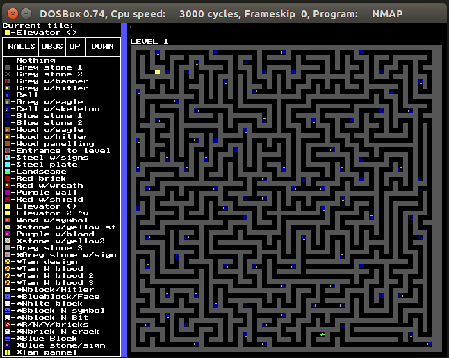
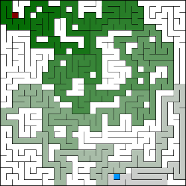
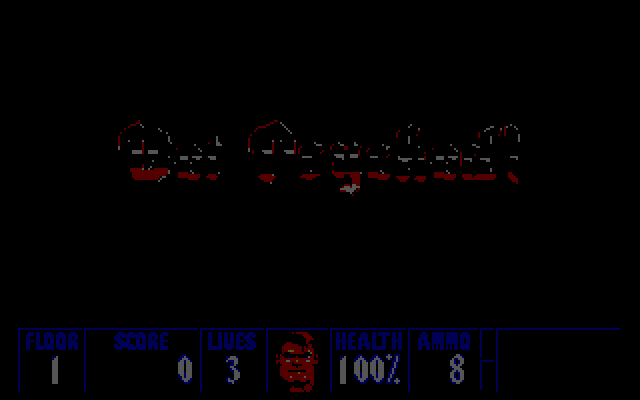

# Mazes For Programmers Python Sources

## Introduction

I'm reading the [Mazes for Programmers](http://www.mazesforprogrammers.com) book, but source code comes in Ruby and I like Python, so I decided to rewrite them as I read. And along the way add tests, both to make sure the conversion is ok and to see a more continuous way than having to write all basic stuff and an "ASCII renderer" before being able to see anything.

A small remark: Code is not a 1:1 copy of the book's. For example I built exporters instead of adding `to_s` and `to_png` methods, pathfinding is also a module that works over traversable grids (those with distances calculated), and a few other changes and extras.

## Implemented algorithms

- `AldousBroder`
- `BinaryTree`
- `HuntAndKill`
- `RecursiveBacktracker`
- `Sidewinder`
- `Wilson`

Note: This list will grow as I progress with the book.

## Implemented exporters

- `ASCIIExporter`: outputs to console
```
+---+---+---+---+---+---+
|                       |
+   +   +   +---+---+   +
|   |   |   |           |
+---+   +---+---+   +   +
|       |           |   |
+---+---+---+---+   +   +
|                   |   |
+   +---+   +   +---+   +
|   |       |   |       |
+   +   +   +   +---+   +
|   |   |   |   |       |
+---+---+---+---+---+---+
```

- `PNGExporter`: outputs to a PNG file on the project root folder (filename will be current datetime)


Depending on the pathfinding and coloring flags combination can draw the colored solution path or a "distance-colored map" from the center.


- `UnicodeExporter`: outputs to console (prettier than raw ASCII)
```
┏━━━━━━━━━━━━━━━━━━━━━━━┓
┃                       ┃
┃           ┏━━━━━━━    ┃
┃   ┃   ┃   ┃           ┃
┣━━━┛   ┣━━━┻━━━        ┃
┃       ┃           ┃   ┃
┣━━━━━━━┻━━━━━━━    ┃   ┃
┃                   ┃   ┃
┃   ┏━━━        ┏━━━┛   ┃
┃   ┃       ┃   ┃       ┃
┃   ┃       ┃   ┣━━━    ┃
┃   ┃   ┃   ┃   ┃       ┃
┗━━━┻━━━┻━━━┻━━━┻━━━━━━━┛
```

#### Wolfenstein 3D Exporter

Special section for my small hack that I'm fond of, a "different" exporter:

- `Wolf3DExporter`: outputs to a LEV file, to be used from [NMAP](http://toastytech.com/files/nmap.html) tool to import as a [Wolfenstein 3D](https://en.wikipedia.org/wiki/Wolfenstein_3D) map. Level exit is at the pathfinding end (most distant cell from starting position), and on each dead-end there is an enemy soldier (when you attack one all will start to move around the map). Also outputs a PNG file with the maze solution. **To be used with** `game_map_demo.py` **demo runner**.





Sample small map playthrough (start at blue, end at red, enemy on deadend at white zone):





## Implemented pathfinding algorithms

- `Dijkstra`: Uses cell distances to calculate maze solution. The actual "core" logic lives at `Distances` base class.
- `LongestPath`: Calculates "a longest path" of the maze. There can be many as it selects a cell as starting point and could be other longer ones.

## Setup

Note: Code is typed using the great library `mypy`.

```
pip install -r requirements.txt
```

## Execute

To run just execute the desired output-based demo:
```
PYTHONPATH=. python3 demos/<filename>
```

Available demo runners:
- `terminal_demo.py`
- `game_map_demo.py`
- `image_demo.py`
- `stats_demo.py`

And read the instructions of required and optional parameters (run without arguments and it will explain usage).

Usually you have to choose a desired grid size (in number of rows and columns) and the algorithm to use. Optionally you can select a few other parameters.

Stats demo runs all available algorithms a certain number of times and gathers statistics and metrics, careful with launching it with big mazes as might take a while.
Sample output:
```
PYTHONPATH=. python3 demos/stats_demo.py 25 25 --pathfinding
Rows: 25
columns: 25
Total cells: 625
Runs per algorithm: 100
Pathfinding: True
> running AldousBroder
> running BinaryTree
> running HuntAndKill
> running RecursiveBacktracker
> running Sidewinder
> running Wilson

Average dead-ends (deadends/total-cells, sorted by % desc):
           AldousBroder: 182/625 (29.12%)
                 Wilson: 181/625 (28.93%)
             Sidewinder: 171/625 (27.29%)
             BinaryTree: 156/625 (24.97%)
   RecursiveBacktracker: 065/625 (10.47%)
            HuntAndKill: 061/625 (9.73%)

Generation speed benchmark (seconds, sorted by average desc):
                 Wilson: avg: 0.641611 min: 0.235594 max: 2.173624
            HuntAndKill: avg: 0.078919 min: 0.059095 max: 0.101278
           AldousBroder: avg: 0.038898 min: 0.015946 max: 0.180922
   RecursiveBacktracker: avg: 0.005492 min: 0.005383 max: 0.006105
             BinaryTree: avg: 0.002130 min: 0.002074 max: 0.002359
             Sidewinder: avg: 0.002105 min: 0.002039 max: 0.002320

Pathfinding speed benchmark (seconds, sorted by average desc):
           AldousBroder: avg: 0.014295 min: 0.011494 max: 0.035487
   RecursiveBacktracker: avg: 0.012775 min: 0.012238 max: 0.014378
            HuntAndKill: avg: 0.012100 min: 0.011589 max: 0.013740
                 Wilson: avg: 0.011712 min: 0.011262 max: 0.013362
             Sidewinder: avg: 0.011641 min: 0.011314 max: 0.013308
             BinaryTree: avg: 0.011561 min: 0.011267 max: 0.013016

```

## Testing

Note: Runs also some linter tests, to conform with both `mypy` and `flake8`.

```
pytest
```

## Roadmap & TODOs

- Of course finish the book and implement all main code and algorithms
- Check in depth mypy doc to see why all the issues with Union, probably I'm doing something wrong and doesn't detects properly hierarchies, etc.
- Dockerize the project -> Will allow to upgrade to Python 3.6 and perform additional mypy cleanups & improvements
- Check to improve Wolf3DExporter drawing of tiles so I can have bigger maps (as each cell now uses 2x2 map tiles)
- Implement more pathfinders -> (e.g. recursive backtracking as a maze solving algorithm)
