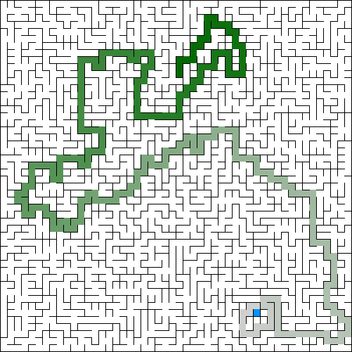

# Mazes For Programmers Python Sources

## Introduction

I'm reading the [Mazes for Programmers](http://www.mazesforprogrammers.com) book, but source code comes in Ruby and I like Python, so I decided to rewrite them as I read. And along the way add tests, both to make sure the conversion is ok and to see a more continuous way than having to write all basic stuff and an "ASCII renderer" before being able to see anything.

A small remark: Code is not a 1:1 copy of the book's. For example I built renderers instead of adding `to_s` and `to_png` methods, pathfinding is also a module that works over traversable grids (those with distances calculated), and a few other changes and extras.

## Implemented algorithms

- `AldousBroder`
- `BinaryTree`
- `HuntAndKill`
- `Sidewinder`
- `Wilson`

Note: This list will grow as I progress with the book.

## Implemented renderers

- `ASCIIRenderer`: outputs to console
```
+---+---+---+---+---+---+
|                       |
+   +   +   +---+---+   +
|   |   |   |           |
+---+   +---+---+   +   +
|       |           |   |
+---+---+---+---+   +   +
|                   |   |
+   +---+   +   +---+   +
|   |       |   |       |
+   +   +   +   +---+   +
|   |   |   |   |       |
+---+---+---+---+---+---+
```

- `PNGRenderer`: outputs to a PNG file on the project root folder (filename will be current datetime)


Depending on the pathfinding and coloring flags combination can draw the colored solution path or a "distance-colored map" from the center.




- `UNICODERenderer`: outputs to console
```
┏━━━━━━━━━━━━━━━━━━━━━━━┓
┃                       ┃
┃           ┏━━━━━━━    ┃
┃   ┃   ┃   ┃           ┃
┣━━━┛   ┣━━━┻━━━        ┃
┃       ┃           ┃   ┃
┣━━━━━━━┻━━━━━━━    ┃   ┃
┃                   ┃   ┃
┃   ┏━━━        ┏━━━┛   ┃
┃   ┃       ┃   ┃       ┃
┃   ┃       ┃   ┣━━━    ┃
┃   ┃   ┃   ┃   ┃       ┃
┗━━━┻━━━┻━━━┻━━━┻━━━━━━━┛
```

## Implemented pathfinding algorithms

- `Dijkstra`: Uses cell distances to calculate maze solution. The actual "core" logic lives at `Distances` base class.
- `LongestPath`: Calculates "a longest path" of the maze. There can be many as it selects a cell as starting point and could be other longer ones.

## Setup

Note: Code is typed using the great library `mypy`.

```
pip install -r requirements.txt
```

## Execute

To run just execute the desired output-based demo:
```
PYTHONPATH=. python3 demos/<filename>
```

Available demo runners:
- `terminal_demo.py`
- `image_demo.py`
- `stats_demo.py`

And read the instructions of required and optional parameters (run without arguments and it will explain usage).

Usually you have to choose a desired grid size (in number of rows and columns) and the algorithm to use. Optionally you can select a few other parameters.

Stats demo runs all available algorithms a certain number of times and gathers statistics and metrics, careful with launching it with big mazes as might take a while.
Sample output:
```
PYTHONPATH=. python3 demos/stats_demo.py 25 25 --pathfinding

Rows: 25
columns: 25
Total cells: 625
Runs per algorithm: 100
Pathfinding: True
> running AldousBroder
> running BinaryTree
> running HuntAndKill
> running Sidewinder
> running Wilson

Average dead-ends (desc):
     AldousBroder: 181/625 (29.01%)
           Wilson: 181/625 (28.97%)
       Sidewinder: 170/625 (27.12%)
       BinaryTree: 156/625 (24.93%)
      HuntAndKill: 062/625 (9.86%)

Generation speed benchmark (seconds, sorted by average desc):
           Wilson: avg: 0.65727073 min: 0.22471986 max: 2.18292433
      HuntAndKill: avg: 0.08903943 min: 0.07111554 max: 0.12254786
     AldousBroder: avg: 0.03225283 min: 0.01685291 max: 0.08700121
       Sidewinder: avg: 0.00232661 min: 0.00208164 max: 0.00273097
       BinaryTree: avg: 0.00217227 min: 0.00209896 max: 0.00251945

Pathfinding speed benchmark (seconds, sorted by average desc):
      HuntAndKill: avg: 0.01336081 min: 0.01190879 max: 0.02201122
       Sidewinder: avg: 0.01306345 min: 0.01151913 max: 0.02009250
           Wilson: avg: 0.01259966 min: 0.01147151 max: 0.01936247
     AldousBroder: avg: 0.01224201 min: 0.01164555 max: 0.01713539
       BinaryTree: avg: 0.01185717 min: 0.01154452 max: 0.01265934
```

## Testing

Note: Runs also some linter tests, to conform with both `mypy` and `flake8`.

```
pytest
```
