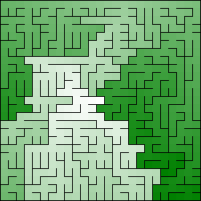

# Mazes For Programmers Python Sources

## Introduction

I'm reading the [Mazes for Programmers](http://www.mazesforprogrammers.com) book, but source code comes in Ruby and I like Python, so I decided to rewrite them as I read. And along the way add tests, both to make sure the conversion is ok and to see a more continuous way than having to write all basic stuff and an "ASCII renderer" before being able to see anything.

A small remark: Code is not a 1:1 copy of the book's. For example I built renderers instead of adding `to_s` and `to_png` methods, pathfinding is also a module that works over traversable grids (those with distances calculated), and a few other changes and extras.

## Implemented algorithms

- `AldousBroder`
- `BinaryTree`
- `Sidewinder`
- `Wilson`

Note: This list will grow as I progress with the book.

## Implemented renderers

- `ASCIIRenderer`: outputs to console
```
+---+---+---+---+---+---+
|                       |
+   +   +   +---+---+   +
|   |   |   |           |
+---+   +---+---+   +   +
|       |           |   |
+---+---+---+---+   +   +
|                   |   |
+   +---+   +   +---+   +
|   |       |   |       |
+   +   +   +   +---+   +
|   |   |   |   |       |
+---+---+---+---+---+---+
```

- `PNGRenderer`: outputs to a PNG file on the project root folder (filename will be current datetime)


Depending on the pathfinding and coloring flags combination can draw the colored solution path or a "distance-colored map" from the center.





- `UNICODERenderer`: outputs to console
```
┏━━━━━━━━━━━━━━━━━━━━━━━┓
┃                       ┃
┃           ┏━━━━━━━    ┃
┃   ┃   ┃   ┃           ┃
┣━━━┛   ┣━━━┻━━━        ┃
┃       ┃           ┃   ┃
┣━━━━━━━┻━━━━━━━    ┃   ┃
┃                   ┃   ┃
┃   ┏━━━        ┏━━━┛   ┃
┃   ┃       ┃   ┃       ┃
┃   ┃       ┃   ┣━━━    ┃
┃   ┃   ┃   ┃   ┃       ┃
┗━━━┻━━━┻━━━┻━━━┻━━━━━━━┛
```

## Implemented pathfinding algorithms

- `Dijkstra`: Uses cell distances to calculate maze solution. The actual "core" logic lives at `Distances` base class.
- `LongestPath`: Calculates "a longest path" of the maze. There can be many as it selects a cell as starting point and could be other longer ones.

## Setup

Note: Code is typed using the great library `mypy`.

```
pip install -r requirements.txt
```

## Execute

To run just execute the desired output-based demo:
```
PYTHONPATH=. python3 demos/terminal_demo.py
```
or:
```
PYTHONPATH=. python3 demos/image_demo.py
```

And read the instructions of required and optional parameters (run without arguments and it will explain usage).

Usually you have to choose a desired grid size (in number of rows and columns) and the algorithm to use. Optionally you can select a few other parameters.


## Testing

Note: Runs also some linter tests, to conform with both `mypy` and `flake8`.

```
pytest
```
